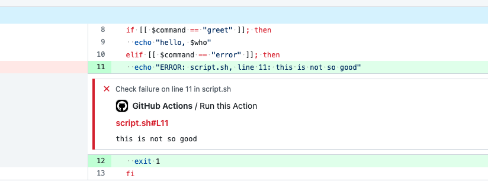

[](https://github.com/rethab/bash-action/actions/workflows/verify.yml)

# Create a Bash Action

Use this template to bootstrap the creation of a bash action.:rocket:

This template includes support for static verification, unit testing, self testing, and annotations.

## Create an action from this template

Click the `Use this Template` and provide the new repo details for your action

## What is included?

This action not only demonstrates how to write an action in pure bash, but also includes some best practices such as static verification and testing.

These checks are run as part of the workflow when pushing new code to GitHub and are defined in the file [.github/workflows/verify.yml](.github/workflows/verify.yml)

### Static Verification & Misc Checks

Static verification is the process of analyzing code and checking it for common errors without running it.
One of the most well known tools for this is [shellcheck](https://www.shellcheck.net) and

Besides code verification, this action also includes checks for formatting making sure all scripts and config files are consistently formatted.
The tools used for this task are [shfmt](https://github.com/mvdan/sh) and [prettier](https://prettier.io).

### Testing Bash Scripts

While not very common, it is possible to write unit tests for bash scripts.
A popular tool for this is [bats](https://github.com/bats-core/bats-core).

This action uses bats to run unit tests whenever code is pushed to GitHub.
The tests are in the folder [test](./test) and have the ending `.bats`.

### Testing the Action

While the previously mentioned checks test individual aspects of the action, this part is about running the action itself.

Running the action is straightforward and can be achieved with the following two steps:

```yaml
steps:
  - uses: actions/checkout@v2
  - uses: ./
```

The tests for this action test both a "positive" and a "negative" scenario.
In the latter case, we want to make sure the action actually fails when we expect it to fail.

Testing for the negative case can be done with the following snippet:

```yaml
steps:
  - uses: actions/checkout@v2
  - uses: ./
    if: error_step
    continue-on-error: true
  - run: exit 1
    if: steps.error_step.outcome == 'success'
```

There are two crucial aspects to this test:

- We make the steps continue even if the step fails by using `continue-on-error: true`
- We fail the following step if the previous step was executed successfully

## Customise this Action for your needs

Okay, so what does this action actually do and how can I extend it?

The [action.yml](action.yml) defines the metadata about this action, such as:

- what is the name of the action
- what inputs does it consume
- how does it run

The last aspect is the most interesting here:
This is a so-called [composite steps action](https://docs.github.com/en/actions/creating-actions/creating-a-composite-action).
All this action does is either directly run some commands or call a bash script like you would do from a workflow directly.

## Make it Fancy / Problem Matchers

There is a not-very-well-documented feature in GitHub Actions called [problem matchers](https://github.com/actions/toolkit/blob/main/docs/problem-matchers.md).

Let's assume you want to write an action for a tool `validate-json` that emits error message like so:

```bash
> validate-json myconfig.json
ERROR: myconfig.json: line 3, column 3: expected ',' but got ':'
WARNING: myconfig.json: line 7, column 1: unused field
```

When running this action on JSON config files, wouldn't it be nice if you could directly annotate files on GitHub in a PR to give the user nice feedback?
This is what this could look like:


Creating these annotations is what problem matches are for:
They allow you to create a regex that matches on the output of your action and then creates the annotations based on that.
All you need to do with the regex is identifying which part of the line the file name, which part is the line number, and what is the error message.

So for the above example, you'd create a regex that says:

- the first word in the line is the severity of the error
- after a colon and a space comes the filename
- after another colon, a space and the word "line" comes the line number
- etc, you get the idea :)

Once you have pieced this regex together, you can put it into a json file install the problem matcher by issuing the following echo:
`echo: "::add-matcher::${GITHUB_ACTION_PATH}/matcher.json"`

Using the environment variable `GITHUB_ACTION_PATH` makes sure the file is correctly referenced regardless of how the action is called.
